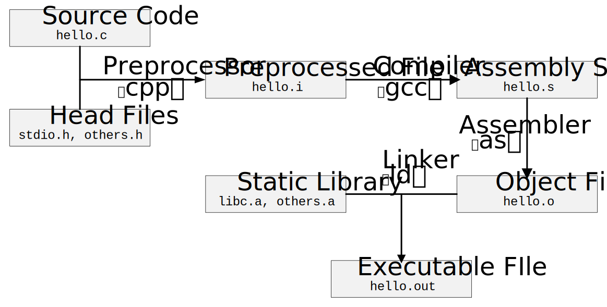
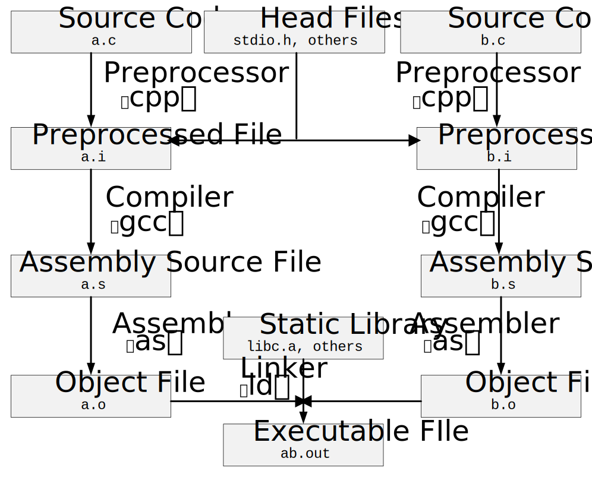

# 第二章 编译和链接

``` C
/* hello.c */

#include <stdio.h>

#define DIVIDOR 10
#define M 1000

int main()
{
    printf("Hello, world!\n");
    
    int a[M] = {0};
    for (int i = 0; i < M; i++) {
        a[i] = i % DIVIDOR;
        printf("%4d", a[i]);
        if ((i + 1) % 20 == 0) printf("\n");
    }

    return 0;
}
```

## 1. GCC 编译过程分解

> `gcc hello.c -o hello.out`



### 1.1. 预处理 Preprocessing

> `gcc -E hello.c -o hello.i` 

or

> `cpp hello.c > hello.i`

- **预处理器 cpp** 处理预编译指令（`#`），预处理后依然是 C 代码
  - 宏定义展开 `#define`
  - 判断条件预编译，比如 `#if`、`#ifdef`、`#elif`、`#else`、`#endif` 等
  - 文件包含 `#include`
  - 删除注释
  - 添加行号和文件名标识

### 1.2. 编译 Compilation

> `gcc -S hello.i -o hello.s`

- **编译器 gcc** 进行词法分析、语法分析、语义分析及优化，得到汇编代码

### 1.3. 汇编 Assembly

> `as hello.s -o hello.o`

or

> `gcc -c hello.c -o hello.o`

- **汇编器 as** 将汇编代码转变成机器可以执行的指令，得到目标文件

### 1.4. 链接 Linking

- **链接器 ld**：地址和空间分配（Address and Storage Allocation）、符号决议（Symbol Resolution）、重定位（Relocation）等
- 处理各个模块之间相互引用的部分，使得各个模块之间能够正确地衔接
- 链接的根本原因：目标代码中有变量定义在其他模块
- 定义在其他模块的全局变量和函数在最终运行时的绝对地址都要在最终链接时才能确定

## 2. 静态链接



- **重定位 Relocation**：当程序修改时，重新计算各个目标地址的过程
- **符号 Symbol**：表示一段子程序（函数）或一个变量的起始地址
- C/C++ 模块之间通信有两种方式：一种是模块间的函数调用，另一种是模块间的变量访问。函数访问须知道目标函数的地址，变量访问也须知道目标变量的地址，所以这两种方式都可以归结为一种方式，那就是模块间**符号的引用**
- **库 Library**：即一组目标文件的包，最常用的代码编译成目标文件后打包存放
- **运行时库 Runtime Library**：支持程序运行的基本函数的集合
- 